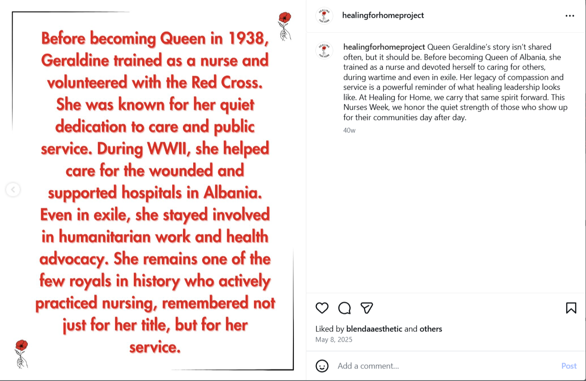
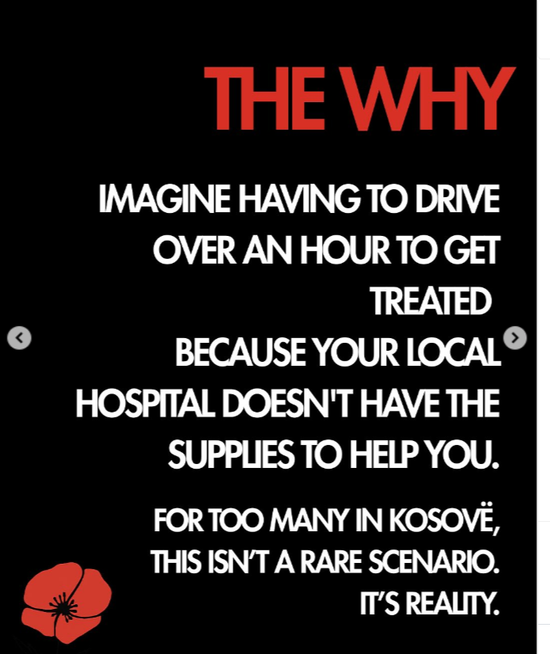

# Healing for Home 🌹
**"Bridging the Gap Between Care and Crisis in Kosovë"**

Healing for Home is a grassroots marketing and social impact initiative dedicated to transforming healthcare accessibility in underfunded communities.

## 🏥 Mission & Strategic Impact
In Kosovë, many patients face a critical reality where local hospitals lack basic medical supplies, forcing long travels for essential care. Our mission focuses on:
* **Direct Collaboration:** Partnering directly with clinics and hospitals.
* **Resource Logistics:** Collecting, purchasing, and shipping essential medical materials.
* **Integrity:** Ensuring every donation reaches the right hands for maximum community impact.

## 🚀 Success Case Study: Lipjan Mission
Our recent campaign successfully equipped the **Main Family Health Center in Lipjan** with life-saving tools:
* **Equipment Delivered:** Donated a respirator, an EKG machine, and 4 fully stocked emergency trauma kits.
* **Measurable Change:** Provided the facility's first-ever access to these critical emergency room tools.

  
  

## 👩‍⚕️ Inspired by Heritage (Storytelling in Marketing)
We leverage historical narratives to drive our mission forward, honoring the legacy of Albanian healthcare pioneers:
* **Queen Geraldine:** A Red Cross volunteer and trained nurse dedicated to wartime care.
* **Sofia Noti:** A symbol of courage who served as a resistance nurse.
* **Hyrije Hana:** A trailblazing midwife who brought care to rural areas.

## ❤️ Join the Movement
* **Donate:** Every contribution fuels direct impact.
* **Sponsor:** Fund specific kits or entire medical facilities.
* **Share:** Amplify our mission to bridge the gap.

  

---
*“We’re doing the work. You can help fund it.”*
